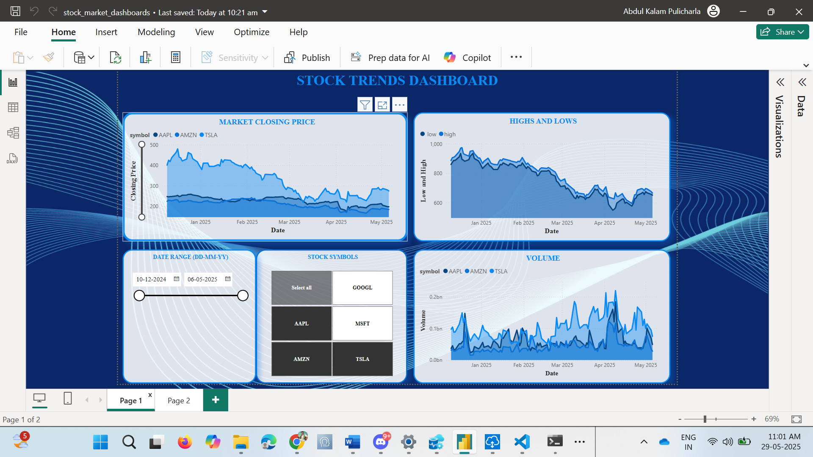
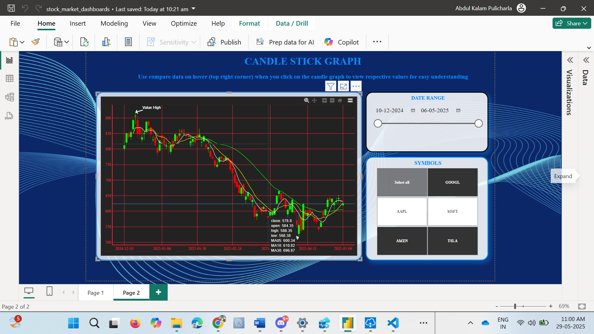

# 📊 Stock Market Dashboard with Alpha Vantage, PostgreSQL & Power BI

This project demonstrates an end-to-end data pipeline for stock market analysis. It integrates real-time data from the **Alpha Vantage API**, processes and stores it in a **PostgreSQL database**, and visualizes insights using **Power BI dashboards**.




---

## 📌 Project Overview

- 🔁 **Data Source**: [Alpha Vantage Public API](https://www.alphavantage.co/)
- 🐍 **ETL Script**: Python for API extraction, data cleaning & formatting
- 🛢️ **Database**: PostgreSQL to store structured stock data
- 📈 **Visualization**: Power BI for dashboards and reporting
- 🔗 **Data Gateway**: On-Premises Gateway to securely connect Power BI Service to local PostgreSQL

---
## 🚀 How This Project Works

This stock market dashboard project follows a simple but powerful data pipeline to fetch, process, store, and visualize stock data using the following steps:

---
### 1. 🧩 Extract Stock Data from Alpha Vantage

* Utilizes the [Alpha Vantage API](https://www.alphavantage.co/) to pull **real-time and historical stock market data**.
* API requests are made using Python's `requests` library.
* Data is retrieved in CSV format depending on the API endpoint used.

---

### 2. 🧹 Clean & Transform the Data with Python

* The raw API response is normalized using **pandas**.
* Null values, duplicates, and formatting issues are handled during preprocessing.
* The cleaned data is prepared in a format suitable for relational storage.

---

### 3. 🗄️ Load into PostgreSQL

* Cleaned stock data is stored in a local **PostgreSQL database**.
* Tables include:
    * `stocks`: static information about the stock symbol
    * `prices`: historical price and volume data
    * `daily_summary`: OHLC data and other metrics
* The data is updated periodically via Python scripts.

---
### 4. 4. 🔌 Connect with Power BI via On-Premises Gateway
* Power BI Desktop connects locally to PostgreSQL for dashboard development

* Power BI Service uses On-Premises Data Gateway to schedule and refresh reports from the local PostgreSQL database securely
---
### 5. 📊 Visualize with Power BI

* Power BI connects directly to the PostgreSQL database using its native connector.
* Dashboards are built to display:
    * **Stock price trends**
    * **Daily volume**
    * **Technical indicators** like MA10, MA30, MA05
* All visuals are interactive and update with refreshed data from PostgreSQL.

---

## 🛠️ Summary of Tools Used

| Stage        | Tool/Technology         |
| :----------- | :---------------------- |
| Extract      | Alpha Vantage API, Python |
| Transform    | Pandas, Python            |
| Load         | PostgreSQL                |
| Visualize    | Power BI Desktop          |

---

This process enables dynamic, data-driven analysis of stock market data in an automated and visual way.

## 📂 Project Structure

```plaintext
stock-market-dashboard/
│
├── data_pipeline/
│   ├── extract.py            # Python script to pull data from Alpha Vantage
│   ├── load.py       # data loading to postgres
│   ├── pipeline.py
│   ├── transform.py

│
├── powerbi/
│   └── stock_dashboard.pbix     # Power BI file (connected to PostgreSQL)
│
├── images/
│   ├── dashboard_preview.png    # Dashboard preview screenshot
│
│   └── candle_sticks.png # Technical indicators screenshot
│
└── README.md


---


